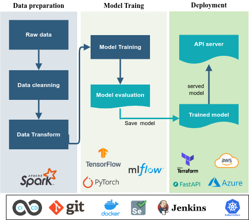

# LLM and NLP for Multi-modal Text/image Analysis

Example projects large language model (LLM), Natural language processing (NLP), and Computer Vision (CV) for AI-Powered for text and image analysis and interpretation:

- [x] Text sentiment analysis [Twitter corpus of 1,600,000 tweets] 
- [ ] content recommendation and summarization
- [ ] medical treatment recommendation

### Development pipeline

The general Machine Learning (ML) pipeline is defined as :

 

Data science framework

#### run a project demo

### Dataset

A sample data set can be downloaded from Kaggle datasets:

- [ Twitter sentiment dataset ](https://www.kaggle.com/datasets/kazanova/sentiment140): It contains 1,600,000 tweets extracted using the twitter api . The tweets have been annotated (0 = negative, 4 = positive) and they can be used to detect sentiment .

### Web application (FastAPI)

The trained model is deployed using FastAPI framework

- **Text sentiment analysis** [Twitter corpus of 1,600,000 tweets] 

 

